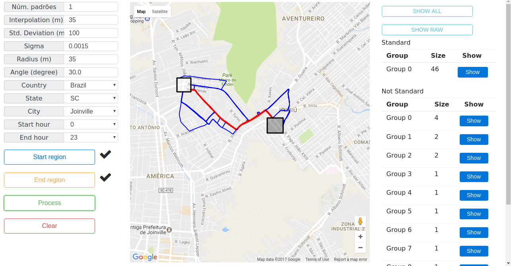

# A Method to Suggest Alternative Routes Based on Analysis of Automobiles’ Trajectories

This is a brief explanation of the proposed Trajectory Outlier Detection and Segmentation (TODS) algorithm presented in the XLIV Latin American Computer Conference (CLEI 2018).

## Quick summary

A brief summary of this study is available below, and more details are present in the paper at the link (#link).

> Abstract—Inexperienced drivers usually use the most-known paths to move inside the cities, while drivers with a better knowledge of the road network normally taken alternative routes that are shorter, faster or safer. This knowledge about roads usage, when shared with other drivers, could offer more paths options to distribute the traffic load across the city by suggesting alternative routes. However, the problem lies in how to suggest alternative route directions for ordinary drivers considering knowledge gathered from experienced drivers. In order to try to solve this problem, it is proposed an algorithm, named TODS – Trajectory Outlier Detection and Segmentation, to group and segment car road trajectories in standard and alternative routes based on city roads usage in different day times periods. After that, the segmentation results are suggested as driving directions for ordinary drivers. To evaluate the results was performed a qualitative comparison with TRA-SOD algorithm considering the segmentation process. The tests were executed using two trajectories datasets collected by drivers in San Francisco – USA and Joinville – Brazil. The results assessment indicate that TODS is superior to TRA-SOD due to its segmentation characteristics. Besides that, it has been observed that the time period of the day influences how routes are used along the day.

## Pseudo-code

The macro pseudo-code related with the TODS algorithm are presented following.

### TODS Algorithm

```
Program: SH, EH, SR, ER, I, SD, σ, D, θ, KS
    t ← FindTrajectories(SR, ER)
    for i ← 0 to Length(t) do
        FilterNoisePoints(t[i], SD, σ)
        InterpolatePoints(t[i], I)
    end for
    C ← GetCandidates(t, SH, EH, SR, ER)
    idx ← CreateClusteringGrid(C, D)
    GT ← GetTrajectoriesGroups(C, idx)
    SGT ← GetStandardTrajectories(GT, KS)
    R ← GetTrajectoriesRoutes(GT, SGT, D, θ)
    return SGT, R
```

### TODS – Trajectory grouping

```
Program: C, idx
    SortTrajectories(C)
    GT ← CreateSetStructure()
    for c ∈ C do
        currentGroup ← empty
        for G ∈ GT do
            if FitInGroup(c, G, idx) then
                currentGroup ← G
                break
            end if
        end for
        if currentGroup = empty then
            currentGroup ← CreateGroup()
            AddGroup(GT, currentGroup)
        end if
        AddCandidate(currentGroup, c)
    end for
    return GT
```

### TODS – Trajectory segmentation

```
Program: GT, STG, NSTG, D, θ
    res ← CreateList()
    for C ∈ NSTG do
        for p ∈ C.points do
            p.std ← HasNear(STG, p, D)
        end for
        for p ∈ C.points do
            if p.std = FALSE then
                BackExtension(p, C, STG, D, θ)
                FrontExtension(p, C, STG, D, θ)
            end if
        end for
        R ← CreateRoute()
        Split(R.DS, R.NDS, C)
        AddRoute(res, R)
    end for
    return res
```

## Repository

The repository available in GitHub is organized as follows.

* "Estatísticas" folder contains results obtained from tests and R scripts used to generate graphs.
* "Estatísticas-last" folder contains the results obtained and R scripts used to write the paper.
* "maps" folder contains some results related to the comparison between TODS and TRA-SOD algorithms.
* "trajectory_outlier_detection_app" contains the application source code, inside this folder we have the following:
  * "database" module is used to query trajectory points. This module has support to PostgreSQL with the PostGIS extension or MongoDB with the geospatial query extensions.
  * "http" module contains the WEB interfaces.
  * "trajectory" module contains the implementations of TODS and TRA-SOD.
  * "webapp" contains the WEB pages.

To start the application is necessary to configure the database according to the “database” module (PostgreSQL or MongoDB). After the database was loaded, is necessary to configure the WEB app in Apache Tomcat and start the app. Finally, the application page to use the TODS is presented below.


